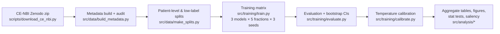

# CE-NBI Endoscopy Foundation Transfer Benchmark

Code, configs, split definitions, and experimental outputs for the QMUL MSc AI dissertation:

> **Do Endoscopy Foundation Models Improve Label-Efficient Laryngeal Lesion Classification? A Patient-Level Benchmark on Public CE-NBI Images**

The project benchmarks three transfer-learning representation families for benign-vs-malignant laryngeal lesion classification on the public CE-NBI dataset (11,144 images / 210 patients), under strict **patient-level evaluation** and **low-label regimes** (5–100% of training labels). It is a benchmark study, not a clinical deployment study.

**Author:** Burhan Khan (ec25164) · MSc Artificial Intelligence, Queen Mary University of London · Supervisor: Tayyaba Irum

## Representation families compared

| # | Family | Backbone | Adaptation |
|---|--------|----------|-----------|
| 1 | ImageNet supervised | ResNet-50 (`timm`) | Full fine-tune |
| 2 | Generic self-supervised | DINOv2 ViT-S/14 | Frozen + linear/MLP head |
| 3 | Endoscopy foundation model | Endo-FM | Frozen + linear/MLP head |

Each model is trained across label fractions {5%, 10%, 25%, 50%, 100%} × seeds {0, 1, 2} — a 45-run matrix — then evaluated with bootstrap 95% CIs, temperature-scaling calibration, statistical tests, and saliency analysis. An image-level split is included **only** as a cautionary data-leakage comparison against the patient-level protocol.

## Architecture

### Pipeline



### Repository layout

```text
├── configs/
│   ├── data.yaml               # dataset paths, image size, class mapping
│   └── experiments.yaml        # model/optimizer/schedule/early-stop settings
├── src/
│   ├── data/
│   │   ├── build_metadata.py   # raw CE-NBI → cleaned metadata CSV + audit report
│   │   ├── make_splits.py      # patient-level main split + low-label subsets (seeded)
│   │   ├── dataset.py          # PyTorch Dataset over metadata + split CSVs
│   │   └── transforms.py       # train/eval augmentation pipelines
│   ├── models/
│   │   ├── registry.py         # model name → (encoder, head, trainability) factory
│   │   ├── encoders.py         # ResNet-50 / DINOv2 / Endo-FM encoders
│   │   └── heads.py            # linear & MLP classification heads
│   ├── training/
│   │   ├── train.py            # single-run trainer (seeded, resume-safe, atomic ckpts)
│   │   ├── evaluate.py         # test metrics + bootstrap 95% CIs, predictions.csv
│   │   └── calibrate.py        # temperature scaling on validation logits
│   ├── analysis/
│   │   ├── metrics.py          # AUROC/AUPRC/F1/ECE (image- and patient-level)
│   │   ├── bootstrap.py        # patient-clustered bootstrap resampling
│   │   ├── plots.py            # aggregation → reports/tables + label-efficiency figures
│   │   ├── saliency.py         # Grad-CAM / attention-rollout implementations
│   │   └── make_saliency.py    # saliency figure generation CLI
│   └── utils/                  # seeding, device (CUDA/MPS/CPU), paths, logging
├── scripts/
│   ├── download_ce_nbi.py      # fetch + verify (MD5) + extract the Zenodo dataset
│   ├── download_endo_fm_weights.md  # manual instructions for Endo-FM weights
│   ├── run_experiments.sh      # full 45-run matrix; resume-safe; skips finished runs
│   └── run_local_mps.sh        # Apple-Silicon smoke runs
├── data/
│   ├── processed/ce_nbi_metadata.csv   # cleaned per-image metadata (committed)
│   └── splits/*.csv                    # exact split files used in the paper (committed)
├── reports/
│   ├── logs/{model}/{regime}/seed_{n}/ # per-run config.yaml, metrics, predictions
│   ├── tables/                         # aggregated results, stat tests, calibration
│   ├── figures/                        # label-efficiency curves, calibration, saliency
│   ├── predictions/                    # key prediction exports
│   └── data_audit.md                   # dataset audit (11,144 images / 210 patients)
├── tests/                      # split-integrity + metrics unit tests (pytest)
├── Implementation.md           # build/decision history
├── requirements.txt            # pinned environment
└── pytest.ini
```

Design notes:

- **Patient-level rigor everywhere:** splits are constructed per patient (`make_splits.py`), metrics are reported at both image and patient level, and bootstrap CIs resample patient clusters, not images.
- **Registry pattern:** `src/models/registry.py` maps a model name to its encoder, head, and which parameters train, so the trainer, evaluator, and calibrator are model-agnostic.
- **Reproducibility:** every run is fully seeded; per-run `config.yaml` snapshots the resolved configuration and library versions; the committed split CSVs are the exact files behind the paper's numbers.

## Setup

```bash
git clone <this-repo>
cd endoscopy-foundation-transfer-benchmark
python3 -m venv .venv
source .venv/bin/activate
pip install -r requirements.txt
```

## Data & weights (not committed — too large)

| Artefact | Size | How to obtain |
|---|---|---|
| CE-NBI dataset ([Zenodo 6674034](https://zenodo.org/records/6674034)) | ~1.4 GB | `python scripts/download_ce_nbi.py` (verifies MD5, extracts) |
| Endo-FM pretrained weights | ~2.2 GB | see [`scripts/download_endo_fm_weights.md`](scripts/download_endo_fm_weights.md) → place at `models/external_weights/endo_fm.pth` |

H100-run model checkpoints are also not committed; every run is exactly reproducible (seeded) from this repository plus the two downloads above.

## How to run

### 1. Data preparation (local, CPU)

```bash
python scripts/download_ce_nbi.py     # download ~1.4 GB CE-NBI zip and extract
python -m src.data.build_metadata     # cleaned metadata + data audit
python -m src.data.make_splits        # patient-level + low-label split CSVs
pytest -q                             # split-integrity + metrics tests
```

The committed `data/splits/*.csv` are the exact files used for the paper's results, so regeneration is only needed for a from-scratch rebuild.

### 2. Full experiment matrix (GPU)

```bash
chmod +x scripts/run_experiments.sh
./scripts/run_experiments.sh
```

Trains ResNet-50, DINOv2, and Endo-FM across label fractions 0.05–1.0, then evaluates, calibrates, and aggregates. Edit `SEEDS=(0 1 2)` inside the script for the 3-seed version. The script is safe to re-run after interruptions — finished runs are skipped, unfinished ones resume.

### 3. Manual single runs

```bash
python -m src.training.train --model resnet50 --label-frac 0.25 --seed 0
python -m src.training.evaluate --model resnet50 --label-frac 0.25 --seed 0 --bootstrap
python -m src.training.calibrate --model resnet50 --label-frac 0.25 --seed 0
python -m src.analysis.plots --aggregate
```

Model names: `resnet50`, `dinov2_vits14`, `endo_fm`. CPU smoke check: append `--max-epochs 1`.

### Per-run outputs

```text
reports/logs/{model}/{label_regime}/seed_{n}/
  config.yaml          # resolved config + library versions
  metrics.json         # written on completion; re-running skips finished runs
  metrics_eval.json    # test metrics + bootstrap CIs
  predictions.csv
  training_curve.csv
  checkpoint_best.pt   # best val AUROC (not committed)
  checkpoint_last.pt   # atomic per-epoch resume state (not committed)
```

Resume is on by default (`--no-resume` forces a fresh start; `--save-every-epoch` keeps all epochs).

## Where the paper's numbers come from

| Paper element | File(s) |
|---|---|
| Main results (mean ± sd over seeds) | `reports/tables/main_results_by_model_fraction.csv`; per-run in `per_run_full.csv` |
| Bootstrap 95% CIs | `reports/logs/{model}/{regime}/seed_{n}/metrics_eval.json` |
| Statistical tests | `reports/tables/stat_tests_patient_auroc.csv`, `stat_tests_cluster_image_auroc.csv`, `stat_tests_wilcoxon.csv` |
| Calibration | `reports/tables/calibration_by_model_fraction.csv` + reliability diagrams in `reports/figures/calibration/` |
| Label-efficiency figures | `reports/figures/label_efficiency_*.png` |
| Saliency figure | `reports/figures/saliency/` |
| Leakage analysis | `reports/logs/{model}/image_level/seed_0/` |
| Dataset audit | `reports/data_audit.md` |

Note: `calibration_by_model_fraction.csv` includes `n_valid_temperature` — ECE-after and mean temperature are computed only over seeds whose fitted temperature is strictly positive (three ResNet-50 fits are excluded and flagged `valid_temperature=False` in `per_run_full.csv`).

## Data source & citation

- CE-NBI dataset: Esmaeili et al., [Zenodo record 6674034](https://zenodo.org/records/6674034)
- Dataset paper: [Scientific Data (2023)](https://www.nature.com/articles/s41597-023-02629-7)
- Endo-FM: pretrained endoscopy foundation model — see `scripts/download_endo_fm_weights.md` for source and licence.

The CE-NBI images and Endo-FM weights are distributed under their own licences by their respective authors and are therefore not redistributed here.
